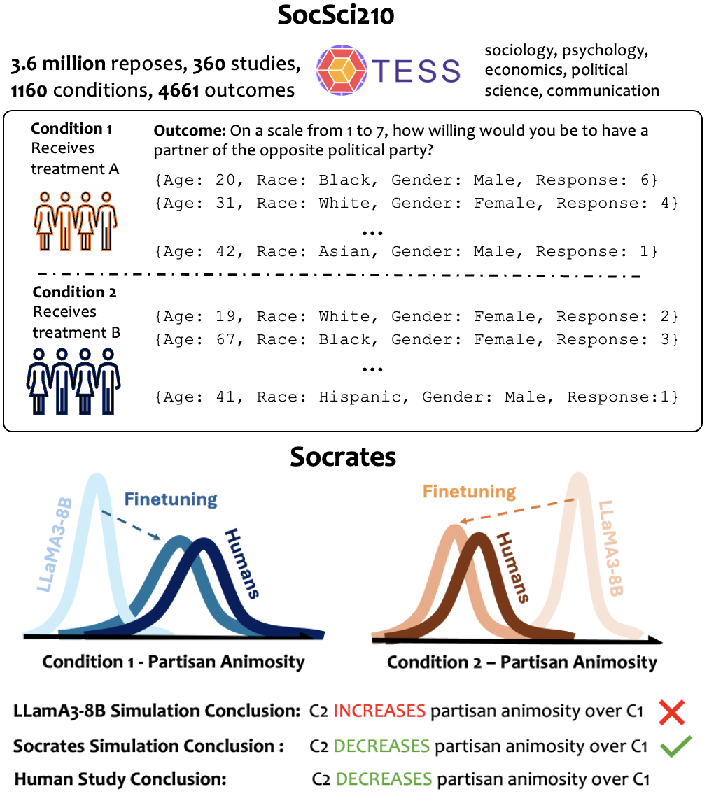

# Finetuning LLMs for Human Behavior Prediction in Social Science Experiments

 

## Credits

The finetuning code in this repo is directly from [LLaMA-Factory](https://github.com/hiyouga/LLaMA-Factory)