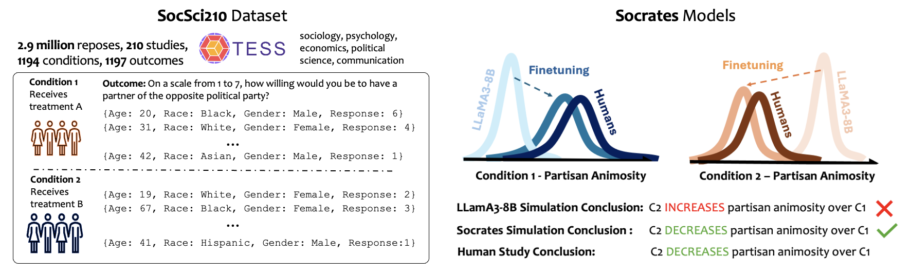

# Finetuning LLMs for Human Behavior Prediction in Social Science Experiments

**Authors:** Akaash Kolluri*¹, Shengguang Wu*¹, Joon Sung Park¹, Michael S. Bernstein¹

*Equal contribution  
¹Stanford University

  

  
  
  

 

## Datasets

We open-source SocSci210 on Hugging Face. Specifically, we open-source the full dataset across all participants in 210 studies, and we also show the splits that we used:

The mapping files are stored in the `metadata/` folder:

- `metadata/participant_mapping.json`: Study-level seen/unseen splits
- `metadata/task_mapping.json`: Sample-level train/eval splits (75/25) by task
- `metadata/condition_mapping.json`: Sample-level train/eval splits (75/25) by condition

Available at: https://huggingface.co/datasets/socratesft/SocSci210

## Models

We open-source our full fine-tuned models. Specifically, all open-source models are trained on all participant data from the 170 studies in the evaluation set. They are not trained on the participant data from the 40 studies not in the evaluation set. Given that SFT and DPO were our best performing methods, we specifically open-source the SFT and DPO variants of a 14B and 8B model. In general, our findings indicated that the SFT models are better for aggregate distribution while DPO is better for individual prediction accuracy, so we recommend choosing which is more apt for your task.

Usage is detailed in the Hugging Face repository.

- Fine-tune of LLaMA3-8B with SFT: https://huggingface.co/socratesft/socrates-llama3-8b-sft
- Fine-tune of LLaMA3-8B with DPO: https://huggingface.co/socratesft/socrates-llama3-8b-dpo
- Fine-tune of Qwen2.5-14B with SFT: https://huggingface.co/socratesft/socrates-qwen2.5-14b-sft
- Fine-tune of Qwen2.5-14B with DPO: https://huggingface.co/socratesft/socrates-qwen2.5-14b-dpo

Attached to each model, there is also a sample script for how to use the model.

## Fine-tuning Code

To fine-tune the model, we use the code directly from [LLaMA-Factory](https://github.com/hiyouga/LLaMA-Factory).

## License

This project contains derivative works from multiple data sources. All derivative works retain the license of their original source.

All models with the name "LLaMA" on Hugging Face are built with Meta Llama 3. These models are a derivative of Meta Llama 3 and are subject to the [Meta Llama 3 Community License Agreement](https://llama.com/llama3/license/).

**Notice**: Llama 3 is licensed under the Llama 3 Community License, Copyright © Meta Platforms, Inc. All Rights Reserved.

All models with the name "Qwen" on Hugging Face are built with Qwen 2.5. These models are derivatives of Qwen 2.5 and are subject to the [Qwen LICENSE AGREEMENT](https://huggingface.co/Qwen/Qwen2.5-72B-Instruct/blob/main/LICENSE).

